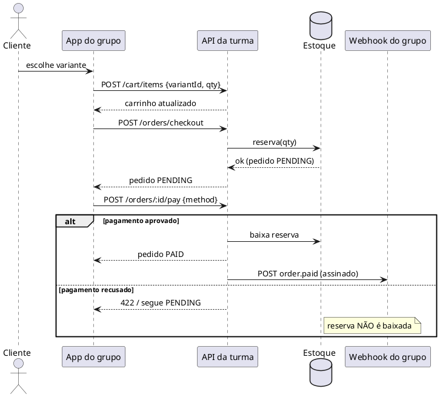

# Sequência do checkout

Abaixo, o mesmo fluxo de compra em **PlantUML** (renderizado pelo servidor público do
PlantUML), com o detalhe da **reserva** e **baixa** de estoque.



:::info Como isto é gerado
Este hub converte blocos ` ```plantuml ` em imagem via um plugin remark próprio
(`src/remark/plantuml.mjs`), que usa o encoding hexadecimal do servidor PlantUML — sem
dependências extras. Precisa de internet no navegador para renderizar.
:::

## Por que reservar no checkout?

Reservar no `checkout` (e não só no pagamento) evita **vender o mesmo item duas vezes**
enquanto o cliente conclui o pagamento. Se o pagamento falhar ou o pedido for cancelado, a
reserva é **liberada** de volta ao estoque disponível.

:::tip Compare com o Mermaid
A [visão geral](visao-geral) e o [fluxo de compra](../guias/fluxo-de-compra) usam **Mermaid**
para o mesmo fluxo. PlantUML brilha em diagramas de sequência mais densos (alt/opt/notes).
:::
