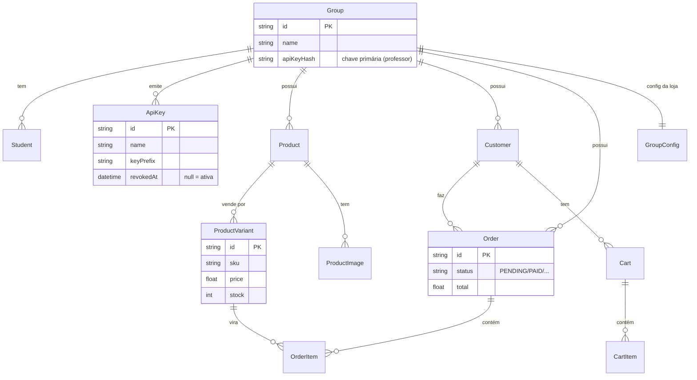

# Modelo de dados

As entidades centrais e como se relacionam. Tudo pendura em **`Group`** (o tenant).

## Leitura rápida

- **`Group`** é o centro: alunos, chaves, produtos, clientes e pedidos são todos _dele_.
- **`ProductVariant`** é a **unidade vendável** — carrega `sku`, `price` e `stock`, e é o
  que vira `OrderItem`.
- **`ApiKey`** guarda só o **hash**; `revokedAt = null` significa chave ativa. Convive com
  a `Group.apiKeyHash` (a chave primária criada pelo professor).
- **`GroupConfig`** guarda a configuração da loja (identidade, contato, tema, regional).

:::note Isolamento na prática
Nenhuma dessas tabelas é consultada sem o filtro de `groupId` (via `tenantScope`). É isso
que garante que um grupo nunca leia dados de outro.
:::
