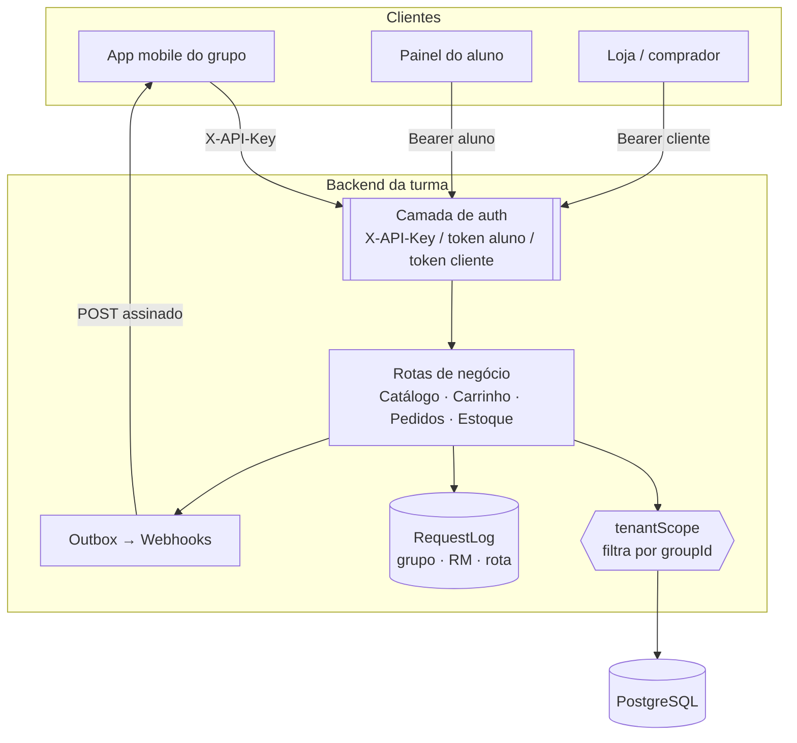
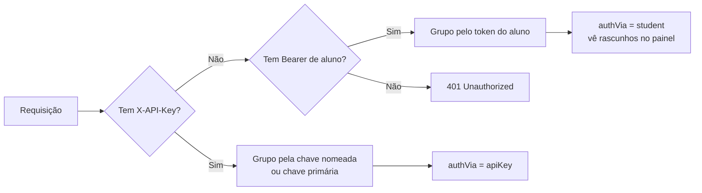

# Visão geral da arquitetura

Um servidor **Fastify + Prisma + PostgreSQL** hospeda todas as lojas. O isolamento é
**explícito** (todo `where` de negócio filtra pelo `groupId`), não pela topologia do banco.

## Princípios

- **Multi-tenant por grupo.** Cada grupo é um _tenant_; os dados nunca vazam entre grupos.
- **Rastreio por RM.** Toda requisição vira uma linha em `RequestLog` (grupo, RM, rota,
  status, latência) — a base da avaliação de participação.
- **Eventos via Outbox.** Mudanças relevantes viram eventos entregues aos webhooks dos
  grupos (at-least-once, com assinatura HMAC).

:::info Onde isso vive no código
`src/plugins/auth.ts` (as 3 camadas), `src/lib/tenantScope.ts` (isolamento) e os módulos
em `src/modules/*` (catálogo, pedidos, webhooks…).
:::

## Camadas de identidade (resumo)

