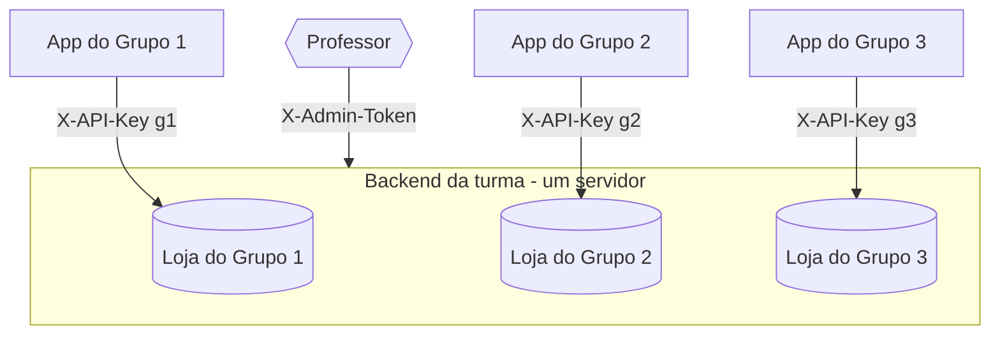

# O que é o projeto

O backend é um **e-commerce multi-tenant**: um único servidor que hospeda **várias lojas
isoladas** — uma por **grupo** da turma. Cada grupo trabalha só nos **seus** produtos,
clientes e pedidos, mesmo todo mundo compartilhando o mesmo servidor e banco.

## Quem é quem

| Papel | Como se identifica | O que faz |
|---|---|---|
| **App do grupo** | `X-API-Key` | Consome a API para montar a loja/app mobile |
| **Aluno** | `X-Student-RM` | Marca **quem** do grupo fez cada chamada (rastreio) |
| **Cliente final** | `Authorization: Bearer` | O comprador que faz login na loja do grupo |
| **Professor** | `X-Admin-Token` | Cria grupos, audita, vê quem trabalhou |

:::note Por que isso importa
Isolamento de dados **não** é a topologia do banco — é o mecanismo de `tenant` aplicado em
toda consulta. Na prática: a sua `X-API-Key` só enxerga os dados do **seu** grupo.
:::

## O que vocês entregam

1. Um **app/loja** (web ou mobile) que consome esta API.
2. As chamadas assinadas com o **RM** de quem trabalhou — isso conta na avaliação.
3. A loja configurada (identidade, contato) e o **grupo montado por RM** no painel.

:::tip Unidade vendável = variante
Todo produto vende por **variante**. Um produto _simples_ tem 1 variante padrão; um
produto _variável_ (ex.: cor × tamanho) tem várias. Guarde bem isso — vale para carrinho,
estoque e preço. Detalhes em [Produtos e variantes](../guias/produtos-e-variantes).
:::
