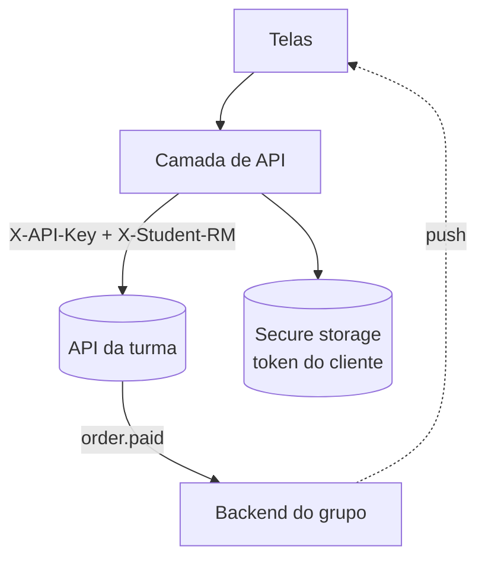

import Tabs from '@theme/Tabs';
import TabItem from '@theme/TabItem';

# Estudo de caso: App mobile

O **Grupo 03** vai construir o app mobile da loja. Aqui as decisões de integração que mais
geram dúvida: onde guardar a chave, como manter o cliente logado e como tratar erros.

## Arquitetura do app



## Decisão 1 — a chave fica no ambiente, não no código

:::danger Não embuta a chave no bundle
Um `.apk`/`.ipa` pode ser descompilado. Para trabalho da turma, use variável de ambiente do
build (ex.: `.env` + `react-native-config`). Em produção real, a chave ficaria num
**backend intermediário** (BFF), nunca no app.
:::

<Tabs groupId="plataforma">
  <TabItem value="rn" label="React Native" default>

```ts title="api.ts"
import Config from 'react-native-config';

const BASE = Config.API_BASE;      // https://.../v1
const API_KEY = Config.API_KEY;    // sk_live_...

export const headers = () => ({
  'X-API-Key': API_KEY,
  'X-Student-RM': Config.STUDENT_RM,
  'Content-Type': 'application/json',
});
```

  </TabItem>
  <TabItem value="flutter" label="Flutter">

```dart title="api.dart"
final base = const String.fromEnvironment('API_BASE');
final apiKey = const String.fromEnvironment('API_KEY');

Map<String, String> headers() => {
  'X-API-Key': apiKey,
  'X-Student-RM': const String.fromEnvironment('STUDENT_RM'),
  'Content-Type': 'application/json',
};
```

  </TabItem>
</Tabs>

## Decisão 2 — token do cliente em armazenamento seguro

Depois do `POST /auth/login`, guarde o token em **Keychain/Keystore** (não em
`AsyncStorage`/`SharedPreferences` puro). Reidrate na abertura do app.

## Decisão 3 — tema a partir da configuração da loja

O app puxa `GET /store/settings` (via painel) ou recebe do BFF a **cor principal** e o
**logo** definidos pelo grupo, aplicando o tema dinamicamente.

```ts
const cfg = await getStoreSettings(); // primaryColor, logoUrl, storeName
theme.primary = cfg.primaryColor ?? '#22c55e';
```

## Decisão 4 — tratar os erros da API

| Situação | O que o app faz |
|---|---|
| `401` chave revogada | Tela de "configuração inválida", pedir nova chave |
| `401` token expirado | Deslogar o cliente e reabrir o login |
| `422` estoque | Mostrar "Sem estoque" e atualizar a tela do produto |
| Sem rede | Fila offline + retry com _backoff_ |

:::tip Webhooks + push
Registre `order.paid` num webhook do **backend do grupo** e, dali, dispare um **push** para
o app. Assim a tela de "meus pedidos" atualiza sozinha, sem polling.
:::
