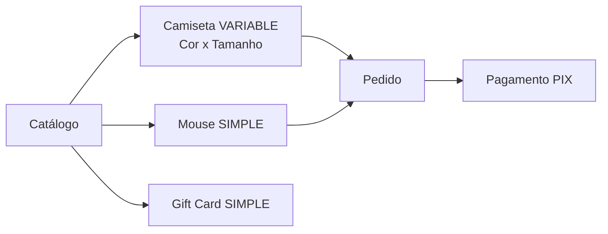

import Tabs from '@theme/Tabs';
import TabItem from '@theme/TabItem';

# Estudo de caso: Loja de Games

O **Grupo 07** vai montar uma loja de games com camisetas (cor × tamanho), periféricos e
gift cards. Vamos acompanhar as decisões e as chamadas.

## Contexto



## Decisão 1 — modelar a camiseta como VARIABLE

Como a camiseta tem **cor** e **tamanho**, ela é `VARIABLE`: cada combinação vira uma
variante com preço e estoque próprios.

```json title="POST /v1/products"
{
  "type": "VARIABLE",
  "name": "Camiseta Retro Arcade",
  "options": [
    { "name": "Cor", "values": ["Preto", "Roxo"] },
    { "name": "Tamanho", "values": ["M", "G"] }
  ],
  "variants": [
    { "sku": "ARC-PT-M", "price": 89.9, "stock": 12, "options": { "Cor": "Preto", "Tamanho": "M" } },
    { "sku": "ARC-RX-G", "price": 89.9, "stock": 7,  "options": { "Cor": "Roxo",  "Tamanho": "G" } }
  ]
}
```

:::tip Por que não SIMPLE?
Se fosse `SIMPLE`, todas as cores/tamanhos dividiriam **um** estoque e **um** SKU — impossível
saber que "Roxo G" esgotou. Sempre que houver escolha do cliente, use `VARIABLE`.
:::

## Decisão 2 — mostrar só o que está publicado

O app da loja usa a `X-API-Key`, então enxerga **apenas** produtos `PUBLISHED`. Enquanto o
grupo ainda está cadastrando, deixam em `DRAFT` (visível só no painel).

## Fluxo de uma venda

<Tabs groupId="lang">
  <TabItem value="js" label="JavaScript" default>

```js
// cliente já logado → auth tem o Bearer
await api.cart.addItem('ARC-RX-G-id', 1);
const pedido = await api.orders.checkout();      // PENDING, reserva 1 un.
await api.orders.pay(pedido.id, { method: 'PIX' }); // PAID, baixa estoque, dispara order.paid
```

  </TabItem>
  <TabItem value="resp" label="Pedido pago">

```json
{
  "id": "cmse...",
  "status": "PAID",
  "total": 89.9,
  "items": [{ "sku": "ARC-RX-G", "quantity": 1, "unitPrice": 89.9 }]
}
```

  </TabItem>
</Tabs>

## Resultado e aprendizado

:::note O que o professor vê
Cada chamada acima levou `X-Student-RM`. No painel do professor, aparece **quem** cadastrou
o produto, **quem** testou o checkout e **quem** integrou o pagamento — participação distribuída.
:::

- ✅ Catálogo com variações reais (estoque por combinação).
- ✅ Estoque coerente (reserva no checkout, baixa no pagamento).
- ✅ `order.paid` via webhook para atualizar o painel do app em tempo real.
