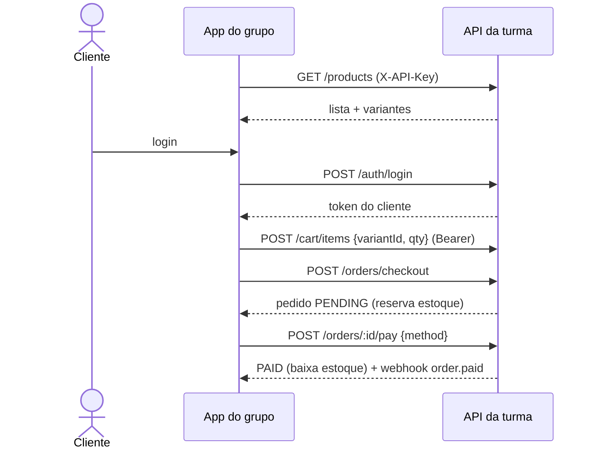

import Tabs from '@theme/Tabs';
import TabItem from '@theme/TabItem';

# Fluxo de compra (ponta a ponta)

O caminho feliz de uma compra tem **5 passos**. A unidade que entra no carrinho é sempre a
**variante** (não o produto).



## Passo a passo

<Tabs groupId="lang">
  <TabItem value="js" label="JavaScript (fetch)" default>

```js title="compra.js"
const BASE = 'http://localhost:3333/v1';
const headers = { 'X-API-Key': API_KEY, 'X-Student-RM': 'RM550001', 'Content-Type': 'application/json' };

// 1) Catálogo → detalhe traz as VARIANTES
const { data } = await fetch(`${BASE}/products`, { headers }).then((r) => r.json());
const produto = await fetch(`${BASE}/products/${data[0].id}`, { headers }).then((r) => r.json());
const variante = produto.variants[0]; // a unidade vendável

// 2) Cliente loga e guarda o token
const { token } = await fetch(`${BASE}/auth/login`, {
  method: 'POST', headers,
  body: JSON.stringify({ email: 'maria@x.com', password: '123456' }),
}).then((r) => r.json());
const auth = { ...headers, Authorization: `Bearer ${token}` };

// 3) Carrinho (por VARIANTE)
await fetch(`${BASE}/cart/items`, {
  method: 'POST', headers: auth,
  body: JSON.stringify({ variantId: variante.id, quantity: 2 }),
});

// 4) Checkout → cria o pedido PENDING e reserva o estoque
const pedido = await fetch(`${BASE}/orders/checkout`, { method: 'POST', headers: auth }).then((r) => r.json());

// 5) Pagar → PAID e baixa o estoque
await fetch(`${BASE}/orders/${pedido.id}/pay`, {
  method: 'POST', headers: auth,
  body: JSON.stringify({ method: 'PIX' }),
});
```

  </TabItem>
  <TabItem value="sdk" label="SDK pronto">

```ts title="com o EcommerceClient"
import { EcommerceClient } from './ecommerce-client';

const api = new EcommerceClient({ baseUrl: BASE, apiKey: API_KEY, studentRm: 'RM550001' });

const { data: produtos } = await api.products.list({ search: 'fone' });
const prod = await api.products.get(produtos[0].id);
await api.auth.login({ email: 'maria@x.com', password: '123456' }); // guarda o token sozinho
await api.cart.addItem(prod.variants[0].id, 2);
const pedido = await api.orders.checkout();
await api.orders.pay(pedido.id, { method: 'CREDIT_CARD' });
```

:::tip SDK oficial
O backend já traz um cliente TypeScript em `Backend/sdk/ecommerce-client.ts`. Ele guarda o
token do cliente automaticamente após `login()`/`register()`.
:::

  </TabItem>
  <TabItem value="curl" label="curl">

```bash
curl "$BASE/products" -H "X-API-Key: $API_KEY" -H "X-Student-RM: RM550001"
curl -X POST "$BASE/cart/items" -H "Authorization: Bearer $TOKEN" \
  -H "X-API-Key: $API_KEY" -H "Content-Type: application/json" \
  -d '{"variantId":"<id>","quantity":2}'
curl -X POST "$BASE/orders/checkout" -H "Authorization: Bearer $TOKEN" -H "X-API-Key: $API_KEY"
curl -X POST "$BASE/orders/<id>/pay" -H "Authorization: Bearer $TOKEN" \
  -H "X-API-Key: $API_KEY" -H "Content-Type: application/json" -d '{"method":"PIX"}'
```

  </TabItem>
</Tabs>

## Pagamento: dois jeitos

<Tabs>
  <TabItem value="sync" label="Atalho síncrono" default>

Paga e confirma na hora — bom para prototipar rápido.

```jsonc
POST /orders/:id/pay   { "method": "PIX" }                                 // aprova (padrão)
POST /orders/:id/pay   { "method": "CREDIT_CARD", "simulate": "decline" }  // força recusa
```

  </TabItem>
  <TabItem value="gateway" label="Gateway realista">

Simula um PSP de verdade: cria cobrança → confirma → dispara webhook.

```jsonc
POST /sandbox/payments             { "method": "PIX", "orderId": "<id>" }  // PENDING
POST /sandbox/payments/:id/settle  { "simulate": "approve" }              // paga + webhook
```

  </TabItem>
</Tabs>

:::warning Estoque e recusa
O **checkout** reserva o estoque (pedido `PENDING`). O **pagamento aprovado** baixa a
reserva (`PAID`). Pagamento **recusado não baixa** estoque. Cancelar um pedido pendente
**libera** a reserva.
:::

:::info Sandbox = tudo fake
Tudo em `/sandbox/*` é simulado (rotulado no Swagger). **Nenhum** dado real de cartão é
aceito — nunca coloque número de cartão verdadeiro.
:::
