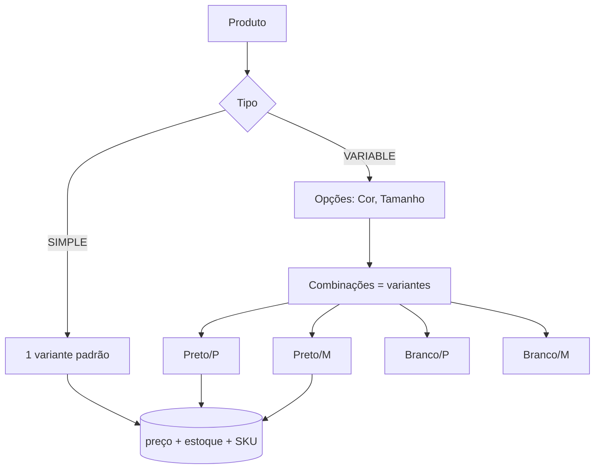

# Produtos e variantes

A regra de ouro do catálogo: **quem vende é a variante**, nunca o produto direto.



## SIMPLE x VARIABLE

| Tipo | Quando usar | Variantes |
|---|---|---|
| **SIMPLE** | Produto sem variação (ex.: carregador) | 1 variante padrão criada automaticamente |
| **VARIABLE** | Tem opções (cor, tamanho…) | 1 variante por **combinação** de opções |

:::tip Preço, estoque e SKU vivem na variante
No detalhe do produto (`GET /products/:id`), o campo `variants[]` traz `id`, `sku`,
`price` e `stock` de cada uma. É o `variant.id` que entra no carrinho.
:::

## Criando um produto VARIABLE

Você define as **opções** (nome + valores) e as **variantes** (uma por combinação):

```json
{
  "type": "VARIABLE",
  "name": "Camiseta Gamer",
  "options": [
    { "name": "Cor", "values": ["Preto", "Branco"] },
    { "name": "Tamanho", "values": ["P", "M"] }
  ],
  "variants": [
    { "sku": "CAM-PT-P", "price": 79.9, "stock": 10, "options": { "Cor": "Preto", "Tamanho": "P" } },
    { "sku": "CAM-PT-M", "price": 79.9, "stock": 8,  "options": { "Cor": "Preto", "Tamanho": "M" } }
  ]
}
```

:::warning Limites
Máximo de **3 opções** por produto e **50 valores** por opção. Combinações de variante
**duplicadas** são rejeitadas (`409`).
:::

## Editando

- **Dados base** (nome, descrição, estado, categoria, marca): `PUT /products/:id`.
- **Preço da variante**: `PATCH /variants/:id`.
- **Estoque**: use os endpoints de estoque (`/variants/:id/stock/receive` e `/adjust`) —
  o preço/patch **não** mexe em estoque.

:::note Estado do produto
`PUBLISHED` aparece na loja; `DRAFT` e `HIDDEN` ficam **só** no painel do grupo. A loja
(via `X-API-Key` do app cliente) enxerga apenas os publicados.
:::
