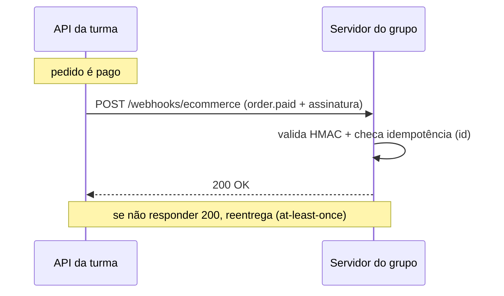

import Tabs from '@theme/Tabs';
import TabItem from '@theme/TabItem';

# Webhooks

Em vez de ficar consultando a API (_polling_), o app do grupo pode **receber eventos** em
tempo real. O backend faz `POST` numa URL pública de vocês quando algo acontece.



## 1. Registrar um endpoint

```ts
const wh = await api.webhooks.create({
  url: 'https://SEU-APP.exemplo.com/webhooks/ecommerce', // precisa ser HTTPS
  events: ['order.paid', 'product.low_stock'],            // ou ['*'] para todos
});
console.log(wh.signingSecret); // GUARDE — mostrado só uma vez!
```

:::danger Guarde o `signingSecret`
Ele é mostrado **uma única vez** e é o que prova que o evento veio do backend. Sem ele,
você não consegue validar a assinatura.
:::

## 2. O que chega

Headers e corpo de cada entrega:

```http
X-Webhook-Event: order.paid
X-Timestamp: 1735689600000
X-Signature: sha256=9f86d081884c7d659a2feaa0c55ad015a...
Content-Type: application/json
```

```json
{
  "id": "evt_abc123",
  "type": "order.paid",
  "createdAt": "2026-08-05T12:00:00.000Z",
  "data": { "orderId": "cmse...", "total": 399.8 }
}
```

## 3. Validar a assinatura (obrigatório)

Recalcule o HMAC-SHA256 de `` `${timestamp}.${body}` `` com o `signingSecret` e compare em
tempo constante.

<Tabs groupId="lang">
  <TabItem value="node" label="Node.js" default>

```ts title="verificarWebhook.ts"
import crypto from 'node:crypto';

export function verificar(secret: string, req): boolean {
  const ts = req.headers['x-timestamp'];
  const assinatura = req.headers['x-signature'];
  const body = req.rawBody; // o corpo CRU (string), não o JSON já parseado
  const esperado =
    'sha256=' + crypto.createHmac('sha256', secret).update(`${ts}.${body}`).digest('hex');
  return crypto.timingSafeEqual(Buffer.from(assinatura), Buffer.from(esperado));
}
```

  </TabItem>
  <TabItem value="python" label="Python">

```python title="verificar_webhook.py"
import hmac, hashlib

def verificar(secret: str, ts: str, assinatura: str, body: str) -> bool:
    esperado = "sha256=" + hmac.new(
        secret.encode(), f"{ts}.{body}".encode(), hashlib.sha256
    ).hexdigest()
    return hmac.compare_digest(assinatura, esperado)
```

  </TabItem>
</Tabs>

:::warning Idempotência (entrega at-least-once)
O **mesmo** evento pode chegar mais de uma vez (ex.: se vocês demoram a responder `200`).
Use o `id` do evento para **não processar duas vezes** — guarde os ids já vistos.
:::

## Eventos disponíveis

Consulte a lista viva em `GET /webhooks/events`. Os mais usados:

| Evento | Quando dispara |
|---|---|
| `order.paid` | Pedido foi pago |
| `order.cancelled` | Pedido pendente foi cancelado |
| `product.low_stock` | Estoque de uma variante cruzou o mínimo |
| `shipment.updated` | Entrega mudou de status (sandbox) |

:::tip Teste sem app público
Use `POST /webhooks/:id/ping` para o backend disparar um evento de teste, e
`GET /webhooks/deliveries` para ver o histórico de entregas e respostas.
:::
