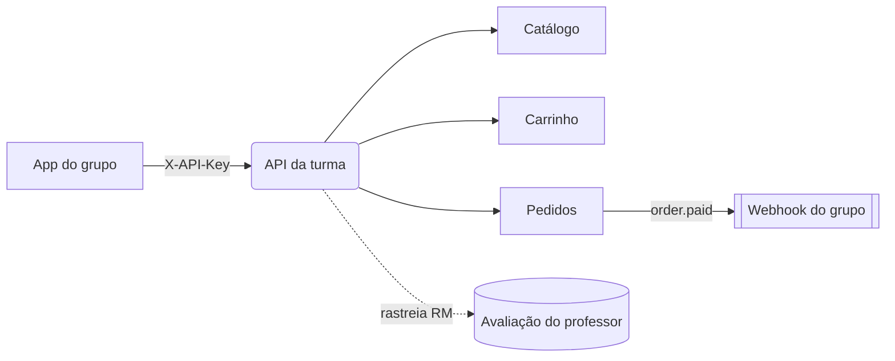

# Hub de documentação — Loja FIAP

Bem-vindo(a)! Este é o **hub central** do projeto de e-commerce da turma **2TDSPG**.
Aqui o seu grupo encontra **o que fazer**, **como integrar** e a **referência dos endpoints**
do backend que já está no ar.

:::tip Em uma frase
Vocês **não** rodam o backend — ele já existe. Vocês **consomem a API** para construir o
app/loja do grupo, autenticando com a **chave de API** que vocês geram no painel.
:::

## Por onde começar

| Se você quer… | Vá para |
|---|---|
| Entender o projeto e os papéis | [O que é o projeto](comece-aqui/o-que-e) |
| Sacar as 3 camadas de identidade | [Conceitos](comece-aqui/conceitos) |
| Fazer a **primeira chamada** hoje | [Primeiros passos](comece-aqui/primeiros-passos) |
| Implementar login, carrinho e checkout | [Guias](guias/autenticacao) |
| Ver diagramas e o modelo de dados | [Arquitetura](arquitetura/visao-geral) |
| Copiar exemplos por endpoint | [Referência de Endpoints](endpoints/visao-geral) |

## O caminho feliz (visão de 30 segundos)

:::info Documentação viva
Além deste hub, a API expõe o **Swagger** interativo em
[`localhost:3333/docs`](http://localhost:3333/docs) — dá pra testar cada endpoint na hora.
Este hub é o **tutorial**; o Swagger é a **referência exaustiva e executável**.
:::

## O que você vai usar aqui

Este hub foi montado com **Docusaurus** e aproveita:

- 🔎 **Busca local** (offline) — atalho <kbd>Ctrl</kbd>/<kbd>⌘</kbd> + <kbd>K</kbd>
- 📊 **Mermaid** e **PlantUML** para diagramas
- 🗂️ **Tabs** para exemplos em `curl` / JavaScript / resposta
- 💡 **Admonitions** (dicas, avisos, perigos)
- 🧮 **Math (KaTeX)** para as fórmulas de total/frete
- 🧭 **Breadcrumbs** e **versionamento** da doc
